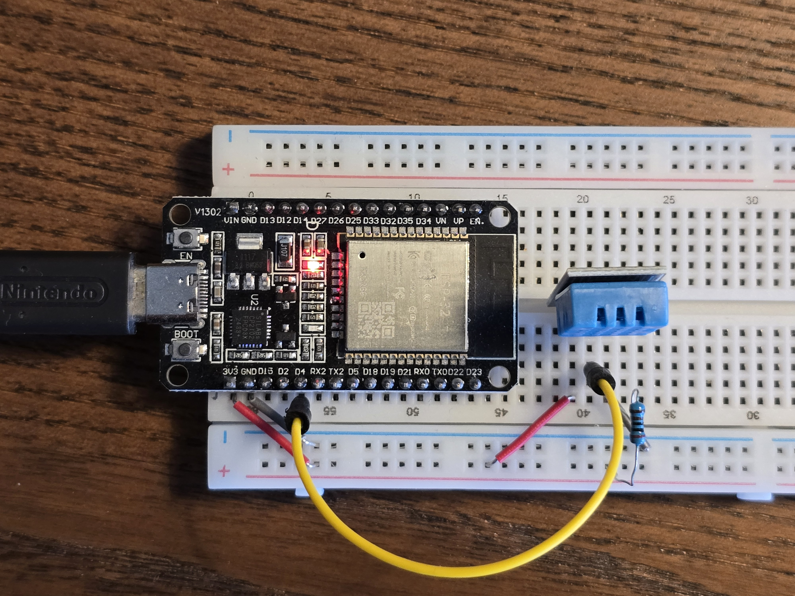

# Edge device firmware implementation

**Author:** Daan Eggen  
**Date:** 11/04/2026  
**Version:** 1.0

---

This document describes the implementation of the temperature and humidity
firmware. This firmware runs on an ESP32 and reads measurements from a DHT11
sensor before publishing them to the MQTT broker every 5 seconds.

The implementation is located in `firmware/temperature-and-humidity`. I will
describe the circuitry, the structure of this project and how the main loop
works.

## Circuitry

For this implementation I built the circuit on a breadboard. This made it easy
to connect the ESP32 and the DHT11 sensor and change the setup during
development.

I placed the sensor on the breadboard, gave it power from the ESP32 and
connected the ground pin as well. After that I added a data cable from the DHT11
data pin to GPIO 4 on the ESP32, because that is the pin the firmware reads
from.



## Software stack

For this implementation I chose the Arduino framework, because it gives me a
simple and reliable way to work with the ESP32.

The project uses the following libraries:

- **WiFi**  
  Used to connect the ESP32 to the wireless network.
- **ArduinoMqttClient**  
  Handles the MQTT connection and publishing of sensor data.
- **Adafruit DHT Sensor Library**  
  Reads temperature and humidity measurements from the DHT11 sensor.

## Project structure

The project is intentionally small. The firmware logic lives in `src`, while
configuration and interfaces live in `include`.

```plaintext
temperature-and-humidity
├── include
│   ├── config.h
│   └── payload.h
├── src
│   ├── main.cpp
│   ├── payload.cpp
│   └── secrets.h
├── mise.toml
└── platformio.ini
```

The `platformio.ini` file defines the ESP32 target and the native test
environment. The `mise.toml` file contains a small helper task to run the test
suite using PlatformIO.

## Configuration

The firmware expects compile time configuration values in `config.h`. The
following is the `config.example.h`, which should be copied when configuring.
This avoids having secrets or environment specific values in the source control.

```cpp
#define SSID "ssid"
#define PASS_PRASE "passprase"

#define MQTT_HOST "mqtt.local"
#define ED_ID "device-id"
```

These values are used to configure the WiFi connection, the MQTT broker and the
edge device identifier. The MQTT topic is created from the edge device id using
the format `sensors/<edge-device-id>`.

## Startup flow

The startup logic is implemented in `src/main.cpp`. On boot, the firmware opens
the serial connection, connects to WiFi and then connects to the MQTT broker.

```cpp
while (WiFi.begin(ssid, passPrase) != WL_CONNECTED) {
  delay(5000);
}

if (!mqttClient.connect(mqttHost)) {
  while (1)
    ;
}
```

This implementation keeps retrying the WiFi connection until it succeeds. If the
MQTT connection fails, the firmware stops execution. That makes the failure
visible during development instead of continuing in an invalid state.

After the network is ready, the firmware initializes the DHT11 sensor using
`dht.begin()`.

## Main loop

The firmware uses a non blocking timer based on `millis()` to publish data at a
5 second interval.

```cpp
unsigned long currentMillis = millis();

if (currentMillis - previousMillis < interval) {
  return;
}

previousMillis = currentMillis;
```

When the interval expires, the firmware reads humidity and temperature from the
sensor.

```cpp
float h = dht.readHumidity();
float t = dht.readTemperature();
```

These values are passed to the payload generator and published to the MQTT
broker.

## Payload format

The payload formatting logic is separated into `src/payload.cpp`. This keeps the
formatting concerns out of the main loop.

```cpp
return "temperature_and_humidity,edge_device_id=" + edgeId + " " +
       "humidity=" + std::to_string(humidity) +
       ","
       "temperature=" +
       std::to_string(temperature);
```

This produces an InfluxDB line protocol message with the measurement name
`temperature_and_humidity`, the tag `edge_device_id` and two fields: `humidity`
and `temperature`.

An example payload looks like this:

```plaintext
temperature_and_humidity,edge_device_id=ED-1022-04 humidity=45.000000,temperature=21.000000
```

## Testing

The project contains both an `esp32dev` environment and a `native` environment
in `platformio.ini`. The native environment excludes `main.cpp`, making it
suitable for testing logic such as payload generation on the host machine.

The `mise.toml` file exposes this as a task:

```toml
[tasks.test]
run = "pio test -e native"
```

This gives me a quick way to verify firmware related logic without flashing the
ESP32 every time.
