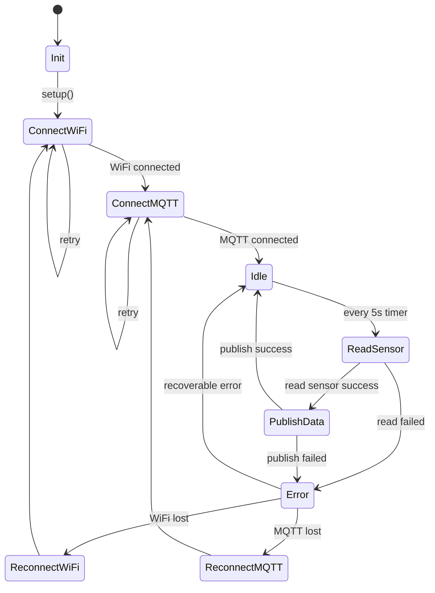

## Edge device technical design

**Author:** Daan Eggen  
**Date:** 06/04/2026  
**Version:** 1.0

---

This document describes technical details regarding the edge devices in the IoT
network. I will describe software specific details.

The edge devices are wired up to different sensors, and they read and publish
sensor data at a 5 second interval. The following state diagram describes the
life cycle of the firmware.

## Software stack

I've chosen the Arduino framework[^arduino] for the foundation of the ESP32
firmware for its simplicity and reliability.

### Core components

- **WiFiManager**  
  Handles connecting to WiFi, reconnection logic, and connection state.
- **MQTTClient**  
  Manages connection to the MQTT broker, publishing messages, and reconnecting.
- **SensorDriver**  
  Responsible for reading data from the connected sensors. Each sensor type
  should implement a common interface.
- **Timer**  
  Provides a non-blocking mechanism to trigger sensor reads every 5 seconds.

## Configuration

Configuration is kept minimal and stored in flash memory.

Configurable parameters:

- WiFi SSID and password
- MQTT broker address and port
- Device ID
- Publish interval (default: 5 seconds)

## Connectivity strategy

### WiFi

- Attempt connection on boot
- Retry indefinitely with delay

### MQTT

- Connect only after WiFi is available
- Use of multi cast DNS to resolve MQTT broker
- Maintain persistent session if supported
- Automatically reconnect when connection drops

[^arduino]: https://www.arduino.cc/
