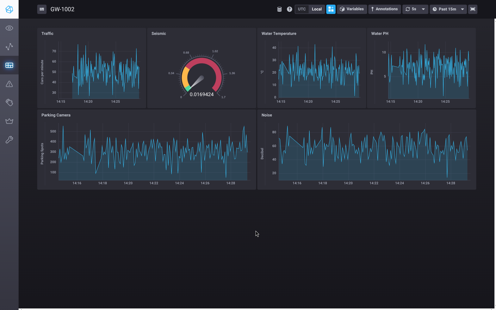
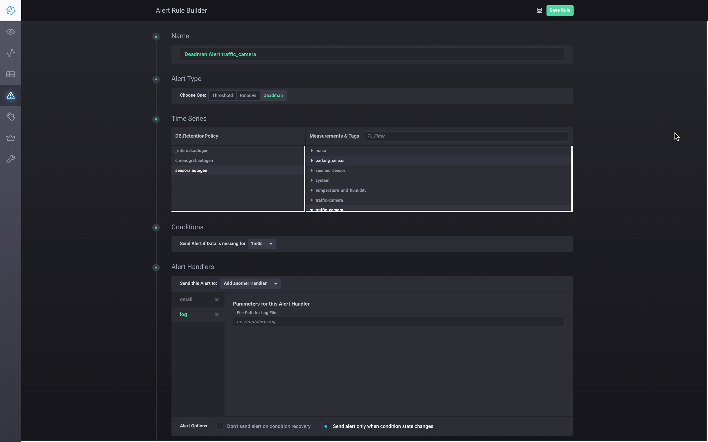
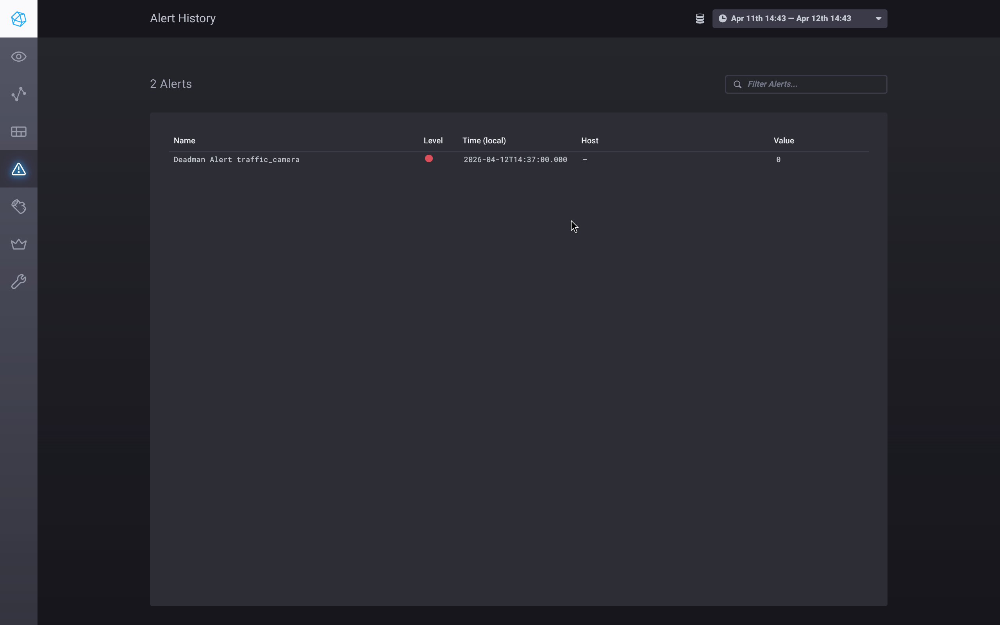

# Monitoring, Logging & Alerting

**Author:** Daan Eggen  
**Date:** 12/04/2026  
**Version:** 1.0

---

The following is a screenshot of the dashboard that I created, composed of the
sensors that are used in my proof of concept.



This dashboard gives a useful overview of the sensor data, but visualization on
its own is not sufficient for monitoring the platform. A graph can show trends
after the fact, but it will not actively notify me when a service goes down, a
sensor stops publishing or the host runs out of resources.

For a proof of concept that depends on continuous MQTT ingestion, I need a more
active monitoring setup. The platform should be able to detect missing sensor
updates and degraded system health without requiring someone to constantly watch
the dashboard.

In this document I describe how I extend the existing InfluxData stack with
alerting. First, I add Kapacitor to evaluate incoming metrics and trigger
alerts. After that, I look at monitoring system resources on the server and the
edge gateway, so infrastructure problems can also be detected early.

## Kapacitor

To add active alerting to the platform, I introduced `Kapacitor`[^kapacitor].
Kapacitor is part of the InfluxData ecosystem and is built to evaluate streams
of metrics and trigger alerts based on rules. That makes it a good fit for this
project, because I already use Telegraf and InfluxDB in the server platform.

The first step was to add it to the Compose project in `server/compose.yaml`.
Just like the other services in the stack, it runs in its own container and has
its state persisted in a named volume.

```yaml
kapacitor:
  container_name: kapacitor
  image: kapacitor
  ports:
    - "9092:9092"
  volumes:
    - kapacitor:/var/lib/kapacitor
    - ./kapacitor.conf:/etc/kapacitor/kapacitor.conf:ro
```

This setup exposes the Kapacitor API on port `9092`, mounts the configuration
file read only and stores task state in `/var/lib/kapacitor`. A named volume is
used here for the same reason as elsewhere in the stack: it keeps the runtime
data managed by Docker and avoids permission issues on the host.

The service is configured in `server/kapacitor.conf`. The most important part of
this file is the InfluxDB connection, because Kapacitor needs access to the
time-series data in order to evaluate alert rules.

```toml
[[influxdb]]
  enabled = true
  name = "default"
  urls = ["http://influxdb3:8181"]
  token = "..."
  disable-subscriptions = true
```

This points Kapacitor to the existing `influxdb3` container. In the current
implementation it connects over HTTP and uses the same database platform that is
already present in the server stack, which keeps the monitoring setup tightly
integrated with the rest of the platform.

### Dead man alert

Now that Kapacitor is setup, I can add rules using the Chronograf web UI. I will
setup a dead man alert on the traffic camera sensor. So, when the sensor has
stopped publishing messages for 1 minute, Kapacitor will trigger a message.



In the rule builder UI of Chronograf, I will select a deadman alert, I will set
the time to 1 min, select the correct table, and the handlers. For the handlers
I chose a log file and email.

After I stopped the sensor simulation for more then 1 minute, the alert showed
up:



[^kapacitor]: https://docs.influxdata.com/kapacitor/
