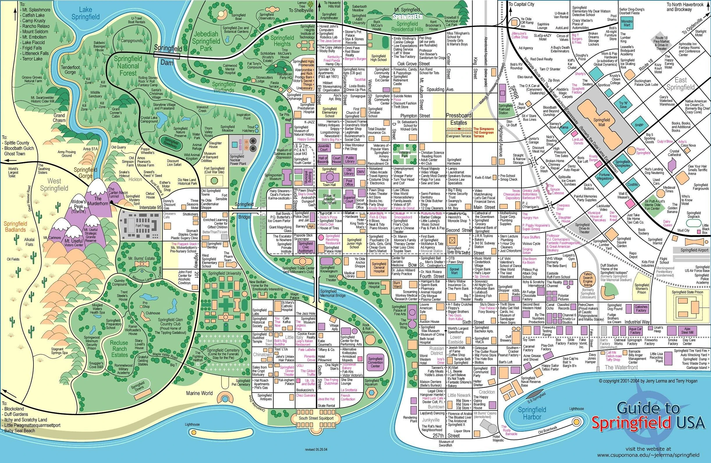

# Sensor Table

**Author:** Daan Eggen  
**Date:** 21/03/2026  
**Version:** 1.0

---

This project requires almost 200 sensors spread out over the city. All of the
edge devices connected to these sensors need to be identifiable and be
addressable.



In these cases, an script that automates the process of dividing the edge
devices and assigning them with ids could be really helpful. It can save time
and reduce mistakes.

## Configuration

For this project, the general idea is that you can create a simple, lean
configuration file defining sensors, which will then be used by a script to
generate a sensor table with ids.

There are a couple of formats which can be used for this configuration file. But
because of the nature of the project, there is a lot of nesting: every
intersection has multiple sensors. JSON and XML are both viable options, but
YAML requires the least boilerplate, making it the most suitable choice for this
use case. YAML will serialize to JSON anyway, so it offers a lot of flexibility
and its easy to edit and read.

The `sensors` are defined at the top level as a mapping of sensor IDs to their
corresponding types.

```yaml
sensors:
  1:
    type: TrafficCamera
  2:
    type: AirQuality
  3:
    type: Noise
  4:
    type: TemperatureAndHumidity
  5:
    type: ParkingSensor
  6:
    type: WaterQuality
  7:
    type: Seismic
```

Next, the `sensor_groups` are defined. Technically this is optional, but it can
save a lot of repetition, which makes editing it later easier. YAML anchors are
used for this, so it gets defined once, and can be reference somewhere else in
the document.

```yaml
sensor_groups:
  default_sensors: &default_sensors [1, 2, 3, 4, 5]
  all_sensors: &all_sensors [1, 2, 3, 4, 5, 6, 7]
```

Now that everything is setup, the `intersections` can be defined. This is simply
a mapping between intersection name, and the corresponding sensors.

```yaml
intersections:
  ElmStreet_OakStreet:
    sensors: *default_sensors
  ElmStreet_MapleStreet:
    sensors: *all_sensors
  ElmStreet_ProspectStreet:
    sensors: [5]
  # ...
```

This setup flexible, sensors can be referenced by sensor group, or just directly
with ids.

## Script

With the configuration in place, a script can be created that loops over the
configuration and divides the devices in the network and assigns them ids.

Python was chosen for this tasks because its commonly used for manipulating
data, and it has great CSV and YAML support.

The script opens the configuration file, and parses it to an object. It then
loops over the `intersections` and assigns ids to sensors, while writing it to
the STDOUT.

```python
#! /usr/bin/env python

import sys
import yaml
import csv


def get_sensor_by_id(sensors, id):
    return sensors[id]["type"]


def main():
    with open("config.yaml") as f:
        config = yaml.safe_load(f)
        sensors = config["sensors"]

    intersections = config["intersections"]

    writer = csv.writer(sys.stdout)
    writer.writerow(["Intersection", "EdgeGatewayId", "EdgeDeviceId", "SensorType"])

    edge_gateway_id = 1001
    for intersection, intersection_value in intersections.items():
        edge_device_id = 1
        for sensor_id in intersection_value["sensors"]:
            sensor = get_sensor_by_id(sensors, sensor_id)
            writer.writerow(
                [
                    intersection,
                    f"GW-{edge_gateway_id}",
                    f"ED-{edge_gateway_id}-{edge_device_id:02}",
                    sensor,
                ]
            )
            edge_device_id += 1
        edge_gateway_id += 1


if __name__ == "__main__":
    main()
```

The output is of the script is CSV.

```bash
$ ./main.py
ElmStreet_OakStreet,GW-1004,ED-1004-01,TrafficCamera
ElmStreet_OakStreet,GW-1004,ED-1004-02,AirQuality
ElmStreet_OakStreet,GW-1004,ED-1004-03,Noise
ElmStreet_OakStreet,GW-1004,ED-1004-04,TemperatureAndHumidity
ElmStreet_OakStreet,GW-1004,ED-1004-05,ParkingSensor
```

Because the output is plain text and written to the STDOUT, shell utilities can
be used to validate the CSV. Like in the following example, `csvstat`[^csvstat]
is used to inspect things like if the unique amount of intersections is the same
as gateway ids.

```bash
$ ./main.py | csvstat
 1. "Intersection"

 Type of data:          Text
 Contains null values:  False
 Non-null values:       172
 Unique values:         34
 Longest value:         30 characters
 Most common values:    ElmStreet_MapleStreet (7x)
                        EvergreenTerrace_CenterStreet (7x)
                        TerraceLane_ElmStreet (7x)
                        MainStreet_ElmStreet (5x)
                        MainStreet_MapleStreet (5x)

 2. "EdgeGatewayId"

 Type of data:          Text
 Contains null values:  False
 Non-null values:       172
 Unique values:         34
 Longest value:         7 characters
 Most common values:    GW-1005 (7x)
                        GW-1022 (7x)
                        GW-1031 (7x)
                        GW-1001 (5x)
                        GW-1002 (5x)

 3. "EdgeDeviceId"

 Type of data:          Text
 Contains null values:  False
 Non-null values:       172
 Unique values:         172
 Longest value:         10 characters
 Most common values:    ED-1001-01 (1x)
                        ED-1001-02 (1x)
                        ED-1001-03 (1x)
                        ED-1001-04 (1x)
                        ED-1001-05 (1x)

 4. "SensorType"

 Type of data:          Text
 Contains null values:  False
 Non-null values:       172
 Unique values:         7
 Longest value:         22 characters
 Most common values:    ParkingSensor (34x)
                        TrafficCamera (33x)
                        AirQuality (33x)
                        Noise (33x)
                        TemperatureAndHumidity (33x)

Row count: 172
```

Lastly, `csvlook`[^csvlook] can be used to format the CSV to a markdown format,
this is nice for presentation.

```bash
$ ./main.py | csvlook > sensors.md
```

## The sensor table

| Intersection                   | EdgeGatewayId | EdgeDeviceId | SensorType             |
| ------------------------------ | ------------- | ------------ | ---------------------- |
| MainStreet_ElmStreet           | GW-1001       | ED-1001-01   | TrafficCamera          |
| MainStreet_ElmStreet           | GW-1001       | ED-1001-02   | AirQuality             |
| MainStreet_ElmStreet           | GW-1001       | ED-1001-03   | Noise                  |
| MainStreet_ElmStreet           | GW-1001       | ED-1001-04   | TemperatureAndHumidity |
| MainStreet_ElmStreet           | GW-1001       | ED-1001-05   | ParkingSensor          |
| MainStreet_MapleStreet         | GW-1002       | ED-1002-01   | TrafficCamera          |
| MainStreet_MapleStreet         | GW-1002       | ED-1002-02   | AirQuality             |
| MainStreet_MapleStreet         | GW-1002       | ED-1002-03   | Noise                  |
| MainStreet_MapleStreet         | GW-1002       | ED-1002-04   | TemperatureAndHumidity |
| MainStreet_MapleStreet         | GW-1002       | ED-1002-05   | ParkingSensor          |
| MainStreet_PineStreet          | GW-1003       | ED-1003-01   | TrafficCamera          |
| MainStreet_PineStreet          | GW-1003       | ED-1003-02   | AirQuality             |
| MainStreet_PineStreet          | GW-1003       | ED-1003-03   | Noise                  |
| MainStreet_PineStreet          | GW-1003       | ED-1003-04   | TemperatureAndHumidity |
| MainStreet_PineStreet          | GW-1003       | ED-1003-05   | ParkingSensor          |
| ElmStreet_OakStreet            | GW-1004       | ED-1004-01   | TrafficCamera          |
| ElmStreet_OakStreet            | GW-1004       | ED-1004-02   | AirQuality             |
| ElmStreet_OakStreet            | GW-1004       | ED-1004-03   | Noise                  |
| ElmStreet_OakStreet            | GW-1004       | ED-1004-04   | TemperatureAndHumidity |
| ElmStreet_OakStreet            | GW-1004       | ED-1004-05   | ParkingSensor          |
| ElmStreet_MapleStreet          | GW-1005       | ED-1005-01   | TrafficCamera          |
| ElmStreet_MapleStreet          | GW-1005       | ED-1005-02   | AirQuality             |
| ElmStreet_MapleStreet          | GW-1005       | ED-1005-03   | Noise                  |
| ElmStreet_MapleStreet          | GW-1005       | ED-1005-04   | TemperatureAndHumidity |
| ElmStreet_MapleStreet          | GW-1005       | ED-1005-05   | ParkingSensor          |
| ElmStreet_MapleStreet          | GW-1005       | ED-1005-06   | WaterQuality           |
| ElmStreet_MapleStreet          | GW-1005       | ED-1005-07   | Seismic                |
| OakStreet_PineStreet           | GW-1006       | ED-1006-01   | TrafficCamera          |
| OakStreet_PineStreet           | GW-1006       | ED-1006-02   | AirQuality             |
| OakStreet_PineStreet           | GW-1006       | ED-1006-03   | Noise                  |
| OakStreet_PineStreet           | GW-1006       | ED-1006-04   | TemperatureAndHumidity |
| OakStreet_PineStreet           | GW-1006       | ED-1006-05   | ParkingSensor          |
| MapleStreet_PineStreet         | GW-1007       | ED-1007-01   | TrafficCamera          |
| MapleStreet_PineStreet         | GW-1007       | ED-1007-02   | AirQuality             |
| MapleStreet_PineStreet         | GW-1007       | ED-1007-03   | Noise                  |
| MapleStreet_PineStreet         | GW-1007       | ED-1007-04   | TemperatureAndHumidity |
| MapleStreet_PineStreet         | GW-1007       | ED-1007-05   | ParkingSensor          |
| MainStreet_IndustrialWay       | GW-1008       | ED-1008-01   | TrafficCamera          |
| MainStreet_IndustrialWay       | GW-1008       | ED-1008-02   | AirQuality             |
| MainStreet_IndustrialWay       | GW-1008       | ED-1008-03   | Noise                  |
| MainStreet_IndustrialWay       | GW-1008       | ED-1008-04   | TemperatureAndHumidity |
| MainStreet_IndustrialWay       | GW-1008       | ED-1008-05   | ParkingSensor          |
| MainStreet_ProspectStreet      | GW-1009       | ED-1009-01   | TrafficCamera          |
| MainStreet_ProspectStreet      | GW-1009       | ED-1009-02   | AirQuality             |
| MainStreet_ProspectStreet      | GW-1009       | ED-1009-03   | Noise                  |
| MainStreet_ProspectStreet      | GW-1009       | ED-1009-04   | TemperatureAndHumidity |
| MainStreet_ProspectStreet      | GW-1009       | ED-1009-05   | ParkingSensor          |
| ElmStreet_ProspectStreet       | GW-1010       | ED-1010-01   | ParkingSensor          |
| OakStreet_ProspectStreet       | GW-1011       | ED-1011-01   | TrafficCamera          |
| OakStreet_ProspectStreet       | GW-1011       | ED-1011-02   | AirQuality             |
| OakStreet_ProspectStreet       | GW-1011       | ED-1011-03   | Noise                  |
| OakStreet_ProspectStreet       | GW-1011       | ED-1011-04   | TemperatureAndHumidity |
| OakStreet_ProspectStreet       | GW-1011       | ED-1011-05   | ParkingSensor          |
| MainStreet_WalnutStreet        | GW-1012       | ED-1012-01   | TrafficCamera          |
| MainStreet_WalnutStreet        | GW-1012       | ED-1012-02   | AirQuality             |
| MainStreet_WalnutStreet        | GW-1012       | ED-1012-03   | Noise                  |
| MainStreet_WalnutStreet        | GW-1012       | ED-1012-04   | TemperatureAndHumidity |
| MainStreet_WalnutStreet        | GW-1012       | ED-1012-05   | ParkingSensor          |
| MainStreet_BirchStreet         | GW-1013       | ED-1013-01   | TrafficCamera          |
| MainStreet_BirchStreet         | GW-1013       | ED-1013-02   | AirQuality             |
| MainStreet_BirchStreet         | GW-1013       | ED-1013-03   | Noise                  |
| MainStreet_BirchStreet         | GW-1013       | ED-1013-04   | TemperatureAndHumidity |
| MainStreet_BirchStreet         | GW-1013       | ED-1013-05   | ParkingSensor          |
| MainStreet_CypressCreekRoad    | GW-1014       | ED-1014-01   | TrafficCamera          |
| MainStreet_CypressCreekRoad    | GW-1014       | ED-1014-02   | AirQuality             |
| MainStreet_CypressCreekRoad    | GW-1014       | ED-1014-03   | Noise                  |
| MainStreet_CypressCreekRoad    | GW-1014       | ED-1014-04   | TemperatureAndHumidity |
| MainStreet_CypressCreekRoad    | GW-1014       | ED-1014-05   | ParkingSensor          |
| ElmStreet_WalnutStreet         | GW-1015       | ED-1015-01   | TrafficCamera          |
| ElmStreet_WalnutStreet         | GW-1015       | ED-1015-02   | AirQuality             |
| ElmStreet_WalnutStreet         | GW-1015       | ED-1015-03   | Noise                  |
| ElmStreet_WalnutStreet         | GW-1015       | ED-1015-04   | TemperatureAndHumidity |
| ElmStreet_WalnutStreet         | GW-1015       | ED-1015-05   | ParkingSensor          |
| ElmStreet_BirchStreet          | GW-1016       | ED-1016-01   | TrafficCamera          |
| ElmStreet_BirchStreet          | GW-1016       | ED-1016-02   | AirQuality             |
| ElmStreet_BirchStreet          | GW-1016       | ED-1016-03   | Noise                  |
| ElmStreet_BirchStreet          | GW-1016       | ED-1016-04   | TemperatureAndHumidity |
| ElmStreet_BirchStreet          | GW-1016       | ED-1016-05   | ParkingSensor          |
| OakStreet_CypressCreekRoad     | GW-1017       | ED-1017-01   | TrafficCamera          |
| OakStreet_CypressCreekRoad     | GW-1017       | ED-1017-02   | AirQuality             |
| OakStreet_CypressCreekRoad     | GW-1017       | ED-1017-03   | Noise                  |
| OakStreet_CypressCreekRoad     | GW-1017       | ED-1017-04   | TemperatureAndHumidity |
| OakStreet_CypressCreekRoad     | GW-1017       | ED-1017-05   | ParkingSensor          |
| MapleStreet_WalnutStreet       | GW-1018       | ED-1018-01   | TrafficCamera          |
| MapleStreet_WalnutStreet       | GW-1018       | ED-1018-02   | AirQuality             |
| MapleStreet_WalnutStreet       | GW-1018       | ED-1018-03   | Noise                  |
| MapleStreet_WalnutStreet       | GW-1018       | ED-1018-04   | TemperatureAndHumidity |
| MapleStreet_WalnutStreet       | GW-1018       | ED-1018-05   | ParkingSensor          |
| MapleStreet_BirchStreet        | GW-1019       | ED-1019-01   | TrafficCamera          |
| MapleStreet_BirchStreet        | GW-1019       | ED-1019-02   | AirQuality             |
| MapleStreet_BirchStreet        | GW-1019       | ED-1019-03   | Noise                  |
| MapleStreet_BirchStreet        | GW-1019       | ED-1019-04   | TemperatureAndHumidity |
| MapleStreet_BirchStreet        | GW-1019       | ED-1019-05   | ParkingSensor          |
| ProspectStreet_WalnutStreet    | GW-1020       | ED-1020-01   | TrafficCamera          |
| ProspectStreet_WalnutStreet    | GW-1020       | ED-1020-02   | AirQuality             |
| ProspectStreet_WalnutStreet    | GW-1020       | ED-1020-03   | Noise                  |
| ProspectStreet_WalnutStreet    | GW-1020       | ED-1020-04   | TemperatureAndHumidity |
| ProspectStreet_WalnutStreet    | GW-1020       | ED-1020-05   | ParkingSensor          |
| ProspectStreet_BirchStreet     | GW-1021       | ED-1021-01   | TrafficCamera          |
| ProspectStreet_BirchStreet     | GW-1021       | ED-1021-02   | AirQuality             |
| ProspectStreet_BirchStreet     | GW-1021       | ED-1021-03   | Noise                  |
| ProspectStreet_BirchStreet     | GW-1021       | ED-1021-04   | TemperatureAndHumidity |
| ProspectStreet_BirchStreet     | GW-1021       | ED-1021-05   | ParkingSensor          |
| EvergreenTerrace_CenterStreet  | GW-1022       | ED-1022-01   | TrafficCamera          |
| EvergreenTerrace_CenterStreet  | GW-1022       | ED-1022-02   | AirQuality             |
| EvergreenTerrace_CenterStreet  | GW-1022       | ED-1022-03   | Noise                  |
| EvergreenTerrace_CenterStreet  | GW-1022       | ED-1022-04   | TemperatureAndHumidity |
| EvergreenTerrace_CenterStreet  | GW-1022       | ED-1022-05   | ParkingSensor          |
| EvergreenTerrace_CenterStreet  | GW-1022       | ED-1022-06   | WaterQuality           |
| EvergreenTerrace_CenterStreet  | GW-1022       | ED-1022-07   | Seismic                |
| EvergreenTerrace_KingsStreet   | GW-1023       | ED-1023-01   | TrafficCamera          |
| EvergreenTerrace_KingsStreet   | GW-1023       | ED-1023-02   | AirQuality             |
| EvergreenTerrace_KingsStreet   | GW-1023       | ED-1023-03   | Noise                  |
| EvergreenTerrace_KingsStreet   | GW-1023       | ED-1023-04   | TemperatureAndHumidity |
| EvergreenTerrace_KingsStreet   | GW-1023       | ED-1023-05   | ParkingSensor          |
| EvergreenTerrace_TerraceLane   | GW-1024       | ED-1024-01   | TrafficCamera          |
| EvergreenTerrace_TerraceLane   | GW-1024       | ED-1024-02   | AirQuality             |
| EvergreenTerrace_TerraceLane   | GW-1024       | ED-1024-03   | Noise                  |
| EvergreenTerrace_TerraceLane   | GW-1024       | ED-1024-04   | TemperatureAndHumidity |
| EvergreenTerrace_TerraceLane   | GW-1024       | ED-1024-05   | ParkingSensor          |
| EvergreenTerrace_WalnutStreet  | GW-1025       | ED-1025-01   | TrafficCamera          |
| EvergreenTerrace_WalnutStreet  | GW-1025       | ED-1025-02   | AirQuality             |
| EvergreenTerrace_WalnutStreet  | GW-1025       | ED-1025-03   | Noise                  |
| EvergreenTerrace_WalnutStreet  | GW-1025       | ED-1025-04   | TemperatureAndHumidity |
| EvergreenTerrace_WalnutStreet  | GW-1025       | ED-1025-05   | ParkingSensor          |
| EvergreenTerrace_BirchStreet   | GW-1026       | ED-1026-01   | TrafficCamera          |
| EvergreenTerrace_BirchStreet   | GW-1026       | ED-1026-02   | AirQuality             |
| EvergreenTerrace_BirchStreet   | GW-1026       | ED-1026-03   | Noise                  |
| EvergreenTerrace_BirchStreet   | GW-1026       | ED-1026-04   | TemperatureAndHumidity |
| EvergreenTerrace_BirchStreet   | GW-1026       | ED-1026-05   | ParkingSensor          |
| EvergreenTerrace_IndustrialWay | GW-1027       | ED-1027-01   | TrafficCamera          |
| EvergreenTerrace_IndustrialWay | GW-1027       | ED-1027-02   | AirQuality             |
| EvergreenTerrace_IndustrialWay | GW-1027       | ED-1027-03   | Noise                  |
| EvergreenTerrace_IndustrialWay | GW-1027       | ED-1027-04   | TemperatureAndHumidity |
| EvergreenTerrace_IndustrialWay | GW-1027       | ED-1027-05   | ParkingSensor          |
| IndustrialWay_CypressCreekRoad | GW-1028       | ED-1028-01   | TrafficCamera          |
| IndustrialWay_CypressCreekRoad | GW-1028       | ED-1028-02   | AirQuality             |
| IndustrialWay_CypressCreekRoad | GW-1028       | ED-1028-03   | Noise                  |
| IndustrialWay_CypressCreekRoad | GW-1028       | ED-1028-04   | TemperatureAndHumidity |
| IndustrialWay_CypressCreekRoad | GW-1028       | ED-1028-05   | ParkingSensor          |
| TerraceLane_MapleStreet        | GW-1029       | ED-1029-01   | TrafficCamera          |
| TerraceLane_MapleStreet        | GW-1029       | ED-1029-02   | AirQuality             |
| TerraceLane_MapleStreet        | GW-1029       | ED-1029-03   | Noise                  |
| TerraceLane_MapleStreet        | GW-1029       | ED-1029-04   | TemperatureAndHumidity |
| TerraceLane_MapleStreet        | GW-1029       | ED-1029-05   | ParkingSensor          |
| TerraceLane_OakStreet          | GW-1030       | ED-1030-01   | TrafficCamera          |
| TerraceLane_OakStreet          | GW-1030       | ED-1030-02   | AirQuality             |
| TerraceLane_OakStreet          | GW-1030       | ED-1030-03   | Noise                  |
| TerraceLane_OakStreet          | GW-1030       | ED-1030-04   | TemperatureAndHumidity |
| TerraceLane_OakStreet          | GW-1030       | ED-1030-05   | ParkingSensor          |
| TerraceLane_ElmStreet          | GW-1031       | ED-1031-01   | TrafficCamera          |
| TerraceLane_ElmStreet          | GW-1031       | ED-1031-02   | AirQuality             |
| TerraceLane_ElmStreet          | GW-1031       | ED-1031-03   | Noise                  |
| TerraceLane_ElmStreet          | GW-1031       | ED-1031-04   | TemperatureAndHumidity |
| TerraceLane_ElmStreet          | GW-1031       | ED-1031-05   | ParkingSensor          |
| TerraceLane_ElmStreet          | GW-1031       | ED-1031-06   | WaterQuality           |
| TerraceLane_ElmStreet          | GW-1031       | ED-1031-07   | Seismic                |
| PineStreet_WalnutStreet        | GW-1032       | ED-1032-01   | TrafficCamera          |
| PineStreet_WalnutStreet        | GW-1032       | ED-1032-02   | AirQuality             |
| PineStreet_WalnutStreet        | GW-1032       | ED-1032-03   | Noise                  |
| PineStreet_WalnutStreet        | GW-1032       | ED-1032-04   | TemperatureAndHumidity |
| PineStreet_WalnutStreet        | GW-1032       | ED-1032-05   | ParkingSensor          |
| PineStreet_BirchStreet         | GW-1033       | ED-1033-01   | TrafficCamera          |
| PineStreet_BirchStreet         | GW-1033       | ED-1033-02   | AirQuality             |
| PineStreet_BirchStreet         | GW-1033       | ED-1033-03   | Noise                  |
| PineStreet_BirchStreet         | GW-1033       | ED-1033-04   | TemperatureAndHumidity |
| PineStreet_BirchStreet         | GW-1033       | ED-1033-05   | ParkingSensor          |
| MapleStreet_CypressCreekRoad   | GW-1034       | ED-1034-01   | TrafficCamera          |
| MapleStreet_CypressCreekRoad   | GW-1034       | ED-1034-02   | AirQuality             |
| MapleStreet_CypressCreekRoad   | GW-1034       | ED-1034-03   | Noise                  |
| MapleStreet_CypressCreekRoad   | GW-1034       | ED-1034-04   | TemperatureAndHumidity |
| MapleStreet_CypressCreekRoad   | GW-1034       | ED-1034-05   | ParkingSensor          |

[^csvstat]:
    https://csvkit.readthedocs.io/en/latest/tutorial/2_examining_the_data.html#csvstat-statistics-without-code

[^csvlook]: https://csvkit.readthedocs.io/en/latest/scripts/csvlook.html
