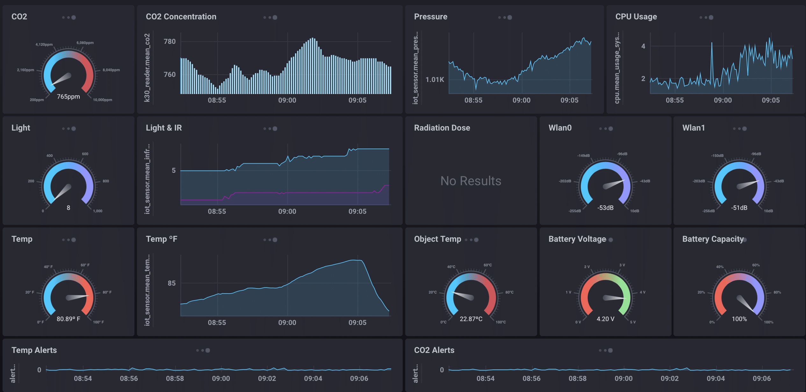

# Server platform

**Author:** Daan Eggen  
**Date:** 28/03/2026  
**Version:** 1.0

---

In this document, I describe the concrete deployment of the server platform. In
the previous "Server Architecture" document, I already selected a self-hosted
InfluxData-based stack. Here, I translate that decision into the services,
configuration files and data flow that are implemented in `server/`.

## Deployment strategy

The server platform needs several services that run simultaneously on one host.
This project benefits from containerized deployment for several reasons.

- "Configuration as code" can be employed for consistency.
- Services are isolated for better security.
- Dependencies are pinned.

The downside of containerization is that it adds complexity, which can make
debugging harder. For this project, that trade-off is acceptable because the
platform consists of multiple networked services that are easier to reproduce
with Docker Compose than with manual host installation.

The implementation is split over two Compose files:

- `compose.yaml` contains the core data platform.
- `compose.mqtt.yaml` contains the MQTT broker that is attached to the same
  Docker network. This is used for debugging only.

This separation keeps the messaging layer loosely coupled. The MQTT broker can
be started independently, while the rest of the platform still assumes a stable,
named Docker network.

## Platform overview

The deployed platform consists of five containers.

| Service             | Purpose                                   | Port   |
| ------------------- | ----------------------------------------- | ------ |
| InfluxDB 3 Core     | Stores time-series sensor data            | `8181` |
| InfluxDB 3 Explorer | Database administration UI                | `9999` |
| Chronograf          | Dashboard and visualization UI            | `8888` |
| Telegraf            | Subscribes to MQTT and writes to InfluxDB | none   |

The data flow is straightforward:

1. Edge devices publish line protocol messages to Mosquitto.
2. Telegraf subscribes to `sensors/#`.
3. Telegraf forwards parsed measurements to InfluxDB 3.
4. InfluxDB Explorer and `Chronograf` connect to the database for management and
   visualization.

## Database [^influxdb]

The database that is used is `InfluxDB 3 Core`. This is a purpose-built
time-series database, so it is optimized for real-time ingestion and querying.
That makes it a good fit for sensor measurements arriving continuously from IoT
devices.

In `compose.yaml`, the database service is configured like this:

```yaml
influxdb3-core:
  container_name: influxdb3
  image: influxdb:3-core
  ports:
    - 8181:8181
  command:
    - influxdb3
    - serve
    - --node-id=smart-springfield
    - --object-store=file
    - --data-dir=/var/lib/influxdb3/data
    - --plugin-dir=/var/lib/influxdb3/plugins
  volumes:
    - influxdb3:/var/lib/influxdb3
```

The intended data model uses a separate table for each sensor type, while device
identifiers are stored as tags to support efficient filtering in queries.

The important implementation choices are:

- Port `8181` is published so that the database can be reached from the host.
- The database uses the local file object store with `/var/lib/influxdb3/data`
  as the data directory.
- A named Docker volume persists the database state.

Using a named volume instead of a bind mount keeps ownership and permissions
under Docker's control, which reduces operational friction.

Next, I describe how data is inserted into those tables.

## Data ingestion

The edge devices publish messages to the MQTT broker. In this section, I
describe the structure of those messages and the topic layout used by the
platform.

### MQTT schema

The message format used by the InfluxData platform is commonly
[line protocol](https://docs.influxdata.com/influxdb3/core/reference/line-protocol/).
It is lightweight, human-readable and fully supported by InfluxData services. A
line protocol message contains a table name, optional tags, fields and an
optional timestamp.

Each sensor type maps to its own table. For example, a vehicle camera sensor
uses `vehicle_camera` as the table name. The edge device identifier is stored as
a tag, while the actual readings are stored as fields. In the current setup, the
edge device does not provide its own timestamp, so the server assigns the write
time.

An example message is:

```plaintext
vehicle_camera,edge_device_id=ED-1001-01 value=42
```

All sensor data is published below the top-level `sensors` topic. The Telegraf
configuration subscribes with a wildcard:

```conf
topics = [
  "sensors/#"
]
```

That means the platform can support either a flat topic like:

```plaintext
sensors
```

or a more structured topic like:

```plaintext
sensors/ED-1001-01
```

The included test publisher currently sends to the flat `sensors` topic, while
the wildcard subscription leaves room for future topic partitioning by gateway
or sensor group.

### Data collection agent

The broker will only retain and forward the messages to other clients. It will
not communicate to the database itself. That is why I need a small service that
collects and stores the data. I don't have to look far because there is already
such a service in the InfluxData stack: Telegraf[^telegraf]. This data
collection agent has a lot of input and output plugins. Inputs can be things
like files or network traffic. Outputs can be databases or just standard output.

For input, I will use the `mqtt_consumer` plugin. This plugin will subscribe to
topics defined in the configuration file. In this case, it subscribes to
`sensors/#`.

For output, I will use the `Influxdb_v3` plugin. This plugin will connect to a
database instance, and insert every data point in the data pipeline.

The implemented `telegraf.conf` looks like this:

```conf
[[inputs.system]]
[[inputs.mqtt_consumer]]
servers = ["tcp://${MQTT_HOST}:1883"]

topics = [
  "sensors/#"
]

[[outputs.file]]

[[outputs.influxdb_v3]]
  urls = ["http://influxdb3-core:8181"]

  ## Token for authentication
  token = "${TOKEN}"

  ## Destination database to write into
  database = "sensors"
```

There are a few notable details in this configuration:

- `MQTT_HOST` is injected through the `.env` file, so the broker address can be
  changed without editing the Telegraf configuration.
- `TOKEN` is also injected through `.env`, which keeps credentials out of the
  committed configuration.
- `[[outputs.file]]` is enabled in addition to the database output. This is
  useful during development because it allows inspection of the collected
  metrics stream.
- `[[inputs.system]]` is enabled too, which means Telegraf can also collect
  basic host or container system metrics alongside MQTT data.

The Telegraf container itself is lightweight:

```yaml
telegraf:
  container_name: telegraf
  image: telegraf:1.38.1
  env_file:
    - .env
  volumes:
    - ./telegraf.conf:/etc/telegraf/telegraf.conf:ro
```

This service is effectively stateless. It only needs the configuration file and
environment variables, so no persistent volume is required.

## Data management

For database administration, I could use the CLI directly. However, that would
require access to the host or the running container, which is not ideal from an
operational or security perspective. A web UI is safer and easier to delegate to
other users because it allows more controlled access patterns.

The InfluxData stack provides a dedicated application for this use case:
`InfluxDB 3 Explorer`. In the Compose setup, it is configured as:

```yaml
influxdb3-ui:
  container_name: influxdb3-explorer
  image: influxdata/influxdb3-ui:1.6.2
  ports:
    - 9999:80
  volumes:
    - influxdb3-ui:/db
  tmpfs:
    - /app-root/config
    - /ca-certs
    - /etc/nginx/ssl
```

This service exposes a browser-based interface on port `9999`. It can be used to
inspect databases and tables, and to perform administrative tasks such as token
management.

The connection to the database is made server-side, so user access to the UI
does not have to imply shell access to the database container itself.

## Data visualization

The visualization layer is provided by Chronograf. This service is responsible
for presenting the stored data in dashboards. Users can connect it to the
InfluxDB instance, define queries and save those queries in reusable dashboard
cells.

In `compose.yaml`, the service is defined as:

```yaml
chronograf:
  container_name: chronograf
  image: chronograf
  environment:
    - INFLUXDB_V3_SUPPORT_ENABLED=true
  ports:
    - 8888:8888
  volumes:
    - chronograf:/var/lib/chronograf
```

The `INFLUXDB_V3_SUPPORT_ENABLED=true` environment variable is important,
because this deployment uses InfluxDB 3 instead of an older 1.x or 2.x server.
Chronograf stores its own configuration in a named volume so dashboards and
connections survive container restarts.



Chronograf is published on port `8888`, making it accessible from the host web
browser.

## Configuration and secrets

The platform uses a local `.env` file for runtime configuration. The example
file shows the required values:

```dotenv
TOKEN=
MQTT_HOST=
```

`TOKEN` is the InfluxDB API token used by Telegraf to write to the `sensors`
database. `MQTT_HOST` points Telegraf to the MQTT broker. In this design, the
token is not hard-coded into Compose or Telegraf configuration files, which is
the correct separation between version-controlled configuration and secrets.

The repository also contains a `mise.toml` file:

```toml
[env.mise]
file = ".env"
```

This ensures the same environment file can be loaded consistently in a local
development shell.

## Operational notes

The `server/scripts/publish-message.sh` script is included as a simple test tool
for the ingestion pipeline. It repeatedly publishes a sample line protocol
message to the broker every five seconds. This makes it easy to validate the
end-to-end flow from MQTT to InfluxDB and finally to the dashboard.

The overall platform layout in the repository is:

```plaintext
server
├── compose.mqtt.yaml
├── compose.yaml
├── mise.toml
├── scripts
│   └── publish-message.sh
└── telegraf.conf
```

With these files, the server platform is fully reproducible. The database,
management UI, dashboard UI, MQTT broker and ingestion agent are all defined as
code, which makes the system easier to deploy, inspect and maintain.

[^influxdb]: https://docs.influxdata.com/influxdb3/core/

[^telegraf]: https://github.com/influxdata/telegraf
